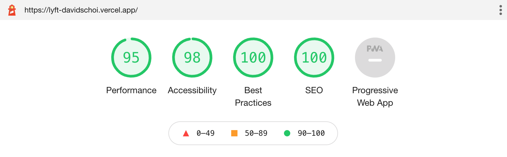

# Lyft - David Choi - Front End Engineer

> Inspired by [lyft.com](https://www.lyft.com/)

## David Choi's Solution

Front End application using [React.js](https://reactjs.org/) for UI, [Next.js](https://nextjs.com/) for SSR and setup, [Styled Components](https://styled-components.com/) for CSS in JS consuming data from [Contentful](https://contentful.com/), deployed through [Vercel](https://vercel.com/)

- Copied the style and content from lyft.com
- Created my own React Components writing CSS with Styled Components
- Used Next.js for routing, image optimization, and everything else to help get my project production ready quickly
- Pulled content data from GraphQL Contentful API at `https://graphql.contentful.com/content/v1/spaces/{SPACE_ID}/explore?access_token={CDA_TOKEN}`
- Deployment through Vercel using environment variables, preview & production deployments
- Mobile and Desktop friendly

<!-- ## To Do

- Bring all content into Contentful
- Create dynamic Page Content Model for Header, Content, and Footer
- More reusable components
- Utilities and helper functions to handle business logic -->

## Lighthouse Score



## Dev Setup

1. Install dependencies

```
yarn install
yarn dev
```

2. Go to [http://localhost:3000](http://localhost:3000)

## View deployed production application

1. Go to [https://lyft-davidschoi.vercel.app/](https://lyft-davidschoi.vercel.app/)
